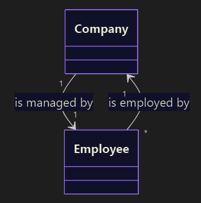
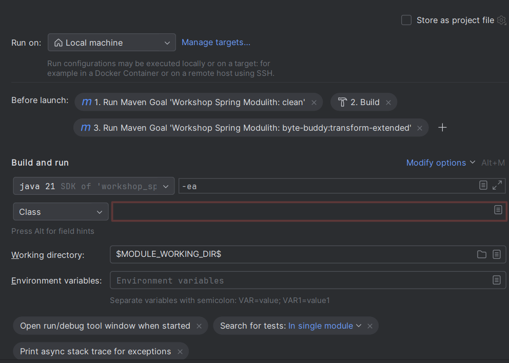

# Spring Modulith Workshop

Das ist der zweite Workshop für die Auswertung des Mental Workload auf die Entwickler bei der Entwicklung mit und ohne Spring Modulith. In diesem Workshop wird der unten beschriebene Use Case mit [Spring Modulith](https://docs.spring.io/spring-modulith/reference/index.html) und [JMolecules](https://github.com/xmolecules/jmolecules) implementiert.

## Use Case

Eine Unternehmensgruppe will eine HR-Anwendung entwickeln. In einem ersten Prototyp werden die Töchterunternehmen und ihre Angestellten abgebildet. Dabei kann jeder Angestellte nur Teil eines Unternehmens sein. Zudem hat jedes Unternehmen einen Administrator, welcher für die Verwaltung der Unternehmensdaten verantwortlich ist. Dieser Administrator ist auch immer ein Angestellter der Unternehmensgruppe.



Unternehmen haben immer einen Namen und eine Adresse.

Angestellte müssen einen Vornamen und Nachnamen, eine Mailadresse im Format `<Vorname>.<Nachname>@mail.com` und ein Geburtsdatum haben.

Für diesen Prototyp ist eine Authentifizierung und Autorisierung nicht nötig.
## Aufgabe
Die zwei APIs `employees.internal.EmployeeAPI` und `companies.internal.CompanyAPI` müssen implementiert werden. Um sicherzustellen, dass beide APIs korrekt implementiert wurden und die Modulstruktur korrekt eingehalten wurde, müssen alle Tests erfolgreich durchlaufen.

Für diese Aufgabe darf die Kommunikation zwischen den Modulen nur asynchron ablaufen.

## Spring Modulith

Spring Modulith ist ein Toolkit, um modulare Anwendungen nach DDD zu bauen. Dabei wird ein großer Fokus auf das Vermeiden von Zyklen und die Verwendung von asynchroner, eventgetriebener Kommunikation gesetzt.

### Module
Spring Modulith Module [bestehen aus drei Teilen](https://docs.spring.io/spring-modulith/reference/fundamentals.html#modules)

1. Einer öffentlichen API und Domain Events
2. Eine interne Implementierung der Komponenten, auf die andere Module nicht zugreifen dürfen. Diese liegen im `internal` Package innerhalb eines Moduls
3. Referenzen auf die öffentliche API und Events anderer Module

#### Verifizierung der Modulstruktur
Spring Modulith [prüft zwei verpflichtende Regeln](https://docs.spring.io/spring-modulith/reference/verification.html), um die Modulstruktur zu validieren.

1. Es dürfen keine Zyklen zwischen Modulen entstehen
2. Ausgehende Zugriff auf Module darf nur durch die API geschehen. 

##### Patterns zum Auflösen von Zyklen
Es gibt mehrere Patterns, um die Zyklen aufzulösen.

1. [Dependency Inversion](https://www.baeldung.com/cs/dip)
2. Das Spiegeln von Aggregates anderer Module

### Verwendung von Application Events
Um die Kopplung zwischen Modulen zu minimieren, [empfiehlt Spring Modulith die Verwendung von Application Events](https://docs.spring.io/spring-modulith/reference/events.html).

Diese können mit dem `ApplicationEventPublisher` versendet werden.

```java
@Service
@RequiredArgsConstructor
public class OrderManagement {

  private final ApplicationEventPublisher events;
  private final OrderInternal dependency;

  @Transactional
  public void complete(Order order) {

    // State transition on the order aggregate go here

    events.publishEvent(new OrderCompleted(order.getId()));
  }
}
```

Damit die Events empfangen werden können, muss die Methode, welche die Events verschickt, mit `@Transactional` annotiert werden. Der Listener muss währenddessen mit `@ApplicationModuleListener` annotiert werden.

```java
@Component
class InventoryManagement {

  @ApplicationModuleListener
  void on(OrderCompleted event) { /* … */ }
}
```

### JMolecules

[JMolecules](https://github.com/xmolecules/jmolecules?tab=readme-ov-file#ideas-behind-jmolecules) ist eine Library um DDD Patterns in der Anwendung explizit auszudrücken. Dabei gibt es einen Ansatz mit [Annotationen](https://github.com/xmolecules/jmolecules) und einen mit [Typen](https://github.com/xmolecules/jmolecules). Es soll der Typen-Ansatz benutzt werden.

#### Aggregates

Aggregate bestehen aus den `AggregateRoot` und `Entity` Typen.

##### Identifier
Aggregate Roots und Entities brauchen immer eine Id. Die Id muss den JMolecules `Identifier` Typ implementieren.

##### Aggregate Root

Aggregate Roots müssen den `AggregateRoot` Typ definieren. Dabei muss immer der Typ der Aggregate Root und deren Id definiert werden. Auf Aggregate Roots darf nur über eine `Association` zugegriffen werden. Somit wird immer nur eine Referenz auf andere Aggregates gespeichert.

###### Auflösen der Aggregate Root

Um leicht auf die Aggregates einer Association zuzugreifen, kann ein Repository [`AssociationResolver`](https://github.com/xmolecules/jmolecules-integrations/tree/main/jmolecules-spring#associationresolver) implementieren.

##### Entities
Entities werden mit dem `Entity` Typ definiert. Entities gehören immer zu einer Aggregate Root und haben eine eigene Id. Aggregate Roots und Entities dürfen nicht auf fremde Entities zugreifen. Entities können jedoch auch mit einer Association auf fremde Aggregate Roots zugreifen.

#### Value Objects
Value Objects sind Typen, deren Identität durch ihre Werte bestimmt wird. Value Objects müssen den `ValueObject` Typ implementieren.

#### Repositories
Repositories müssen den JMolecules `Repository` Typ implementieren. Im Vergleich zu Spring `JpaRepository` gibt es keine vordefinierten Methoden. Alle Repository Methoden müssen manuell definiert werden.

Zugriffe auf ein Aggregate über die Id müssen über den richtigen Typ geschehen.

#### Services
Für Service soll die JMolecules `@Service` Annotation benutzt werden. Es gibt keinen Service Typ.

#### Tests

Da JMolecules ByteBuddy benutzt, um die JMolecules Annotationen in Spring Annotationen umzuwandeln, muss der `byte-buddy:transform-extendend` goal ausgeführt werden. Für Maven ist dieser Schritt bereits konfiguriert, IntelliJ benutzt jedoch ein eigenes Build System, um die Tests auszuführen, daher muss dieser Schritt manuell gemacht werden.

Dafür muss die Run Config Template für JUnit angepasst werden. Es muss die Before Launch Einstellung aktiviert und der `clean` und `byte-buddy:transform-extended` Goal hinzugefügt werden.




Bereits erstellte Run Configs müssen manuell angepasst werden.